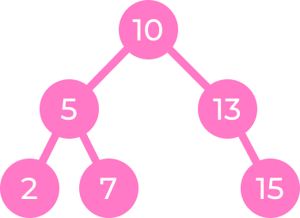
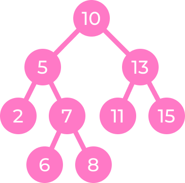
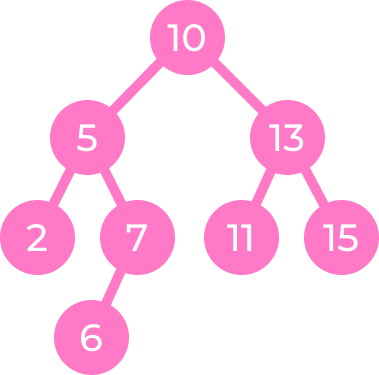
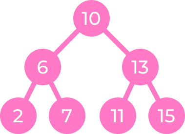
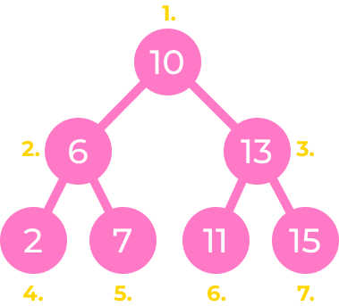
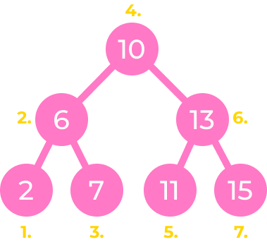
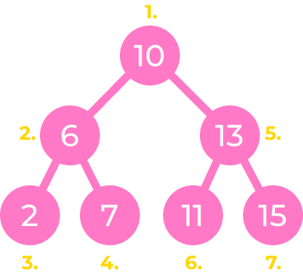
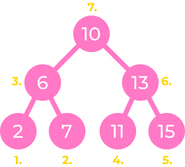

# Dvejetainis paieškos medis

> VU ISI Duomenų struktūros ir algoritmai, užduotis B19.

- [Medžio sukūrimas](#medžio-sukūrimas)
- [Elemento paieška](#elemento-paieška)
  - [Contains](#contains)
  - [Find](#find)
  - [Find Max](#find-max)
  - [Find Min](#find-min)
- [Elemento įterpimas](#elemento-įterpimas)
- [Elemento šalinimas](#elemento-šalinimas)
- [Medžio apėjimas](#medžio-apėjimas)
  - [Breadth first search - level by level](#breadth-first-search---level-by-level)
  - [Depth first search - in order](#depth-first-search---in-order)
  - [Depth first search - pre order](#depth-first-search---pre-order)
  - [Depth first search - post order](#depth-first-search---post-order)

---

## Medžio sukūrimas

Inicializuojame ir sukuriame medį su viršūne, kurios reikšmė yra `10`.

```javascript
const bst = new BST(10);
// BST {
//   root: Node {
//     value: 10,
//     left: null,
//     right: null
//   }
// }
```

Papildykime medį elementais `5`, `13`, `2`, `7`, `15`

```javascript
bst.insert(5);
bst.insert(13);
bst.insert(2);
bst.insert(7);
bst.insert(15);
```



---

## Elemento paieška

Paieška realizuota keturiais metodais:

- `contains(value)`
- `find(value)`
- `findMax()`
- `findMin()`

### Contains

Funkcija `contains(value)` grąžina `bool` reikšmę, identifikuojančią, ar elementas su verte `value` egzistuoja medyje:

```javascript
bst.contains(25); // false
bst.contains(13); // true
```

### Find

Funkcija `find(value)` medyje ieško šakos _(node)_, kurios vertė yra `value`. Jei tokia šaka egzistuoja - tai ją grąžina vartotojui, jei ne - tuomet `null`:

```javascript
bst.find(5);
// Node {
//   value: 5,
//   left: Node {
//     value: 2,
//     left: null,
//     right: null
//   },
//   right: Node {
//     value: 7,
//     left: null,
//     right: null
//   }
// }

bst.find(20);
// null
```

### Find max

Funkcija `findMax()` grąžina šaką _(node)_, kurios vertė medyje yra didžiausia:

```javascript
bst.findMax();
// Node {
//   value: 15,
//   left: null,
//   right: null
// }
```

### Find min

Funkcija `findMin()` grąžina šaką _(node)_, kurios vertė medyje yra mažiausia:

```javascript
bst.findMin();
// Node {
//  value: 2,
//  left: null,
//  right: null
// }
```

---

## Elemento įterpimas

Įterpimo į medį funkcionalumas realizuotas su metodu `insert(value)`, kuris grąžina įterptą šaką.

Įterpkime 3 papildomas šakas, su reikšmėmis `6`, `8` ir `11`

```javascript
bst.insert(6);
// Node { value: 6, left: null, right: null }

bst.insert(8);
// Node { value: 8, left: null, right: null }

bst.insert(11);
// Node { value: 11, left: null, right: null }
```

Dabar medis atrodo taip:



---

## Elemento šalinimas

Elemento šalinimas iš medžio realizuotas metodu `remove(value)`.

Pašalinkime 2 šakas: `8` ir `5`. Pradėkime pašalinimą nuo šakos, kuri turi vertę `8`:

```javascript
bst.remove(8);
```



Dabar pašalinkime šaką su verte `5`. Pastebėkite, kaip keičiasi medžio struktūra:

```javascript
bst.remove(5);
```



---

## Medžio apėjimas

Medžio apėjimas realizuotas 4 metodais:

- breadth first search:
  - level by level: `bfs()`
- depth first search:
  - branch by branch - **in-order**: left, root, right: `dfsInOrder()`
  - **pre-order**: root, left, right: `dfsPreOrder()`
  - **post-order**: left, right, root: `dfsPostOrder()`

### Breadth first search - level by level

```javascript
bst.bfs(); // 10, 6, 13, 2, 7, 11, 15
```



### Depth first search - in order

```javascript
bst.dfsInOrder(); // 2, 6, 7, 10, 11, 13, 15
```



### Depth first search - pre order

```javascript
bst.dfsPreOrder(); // 10, 6, 2, 7, 13, 11, 15
```



### Depth first search - post order

```javascript
bst.dfsPostOrder(); // 2, 7, 6, 11, 15, 13, 10
```


